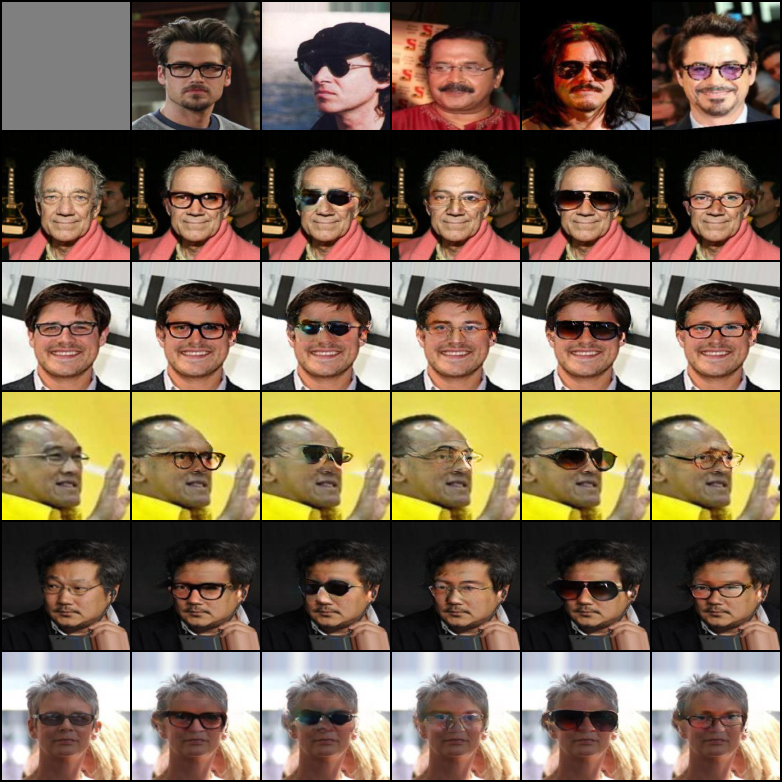

# Virtual Glasses Try-On

The task of virtual glasses try-on, that is, replacing the glasses in an image, consists of removing the glasses feature from an image and transferring new glasses to it. 
<br> <b> This repository contains two branches. The "pipeline_approach" branch and the "master" branch represent two different approches, where in each we explore a different way of leveraging image completion and content transfer methods for virtual glasses try-on.</b>
<br>
<br>
<b>For details of the first approach see [README](https://github.com/ShlomoLibo/Pluralistic-Inpainting/blob/pipeline_approach/README.md) in "pipeline_approach" branch.</b>
<br>
<br>
## Guided Image Completion for Virutal Glasses Try-On
The input to our model is two images: one of the person who we want to try the glasses on ('original image'), and one of the desired glasses ('feature image'). 
We are using a novel approach, based on [pluralistic image completion](https://github.com/lyndonzheng/Pluralistic-Inpainting) network  to generate an image with the desired glasses, using a fixed rectangular masked covering the eyes' area. 

Our work utilizes previous research and is based on two earlier articles:

[The first](https://github.com/rmokady/mbu-content-tansfer), presents a network that is used for image-to-image translation between two domains, where one contains additional information, for example glasses, in an unsupervised way.
<br>
[The second](https://github.com/lyndonzheng/Pluralistic-Inpainting), presents an approach for pluralistic image completion, generating multiple plausible solutions for image completion. 

Concretely, we utilize the Es network presented in the [first article](https://github.com/rmokady/mbu-content-tansfer) to evaluate how closely the glasses in the resulted image resemble the glasses in the feature image. We use an L2 distance measure.
We are motivated by the success of the [perceptual loss](http://svl.stanford.edu/assets/papers/JohnsonECCV16.pdf) approach.


## Example results


Example of virtual glasses try on for multiple types of glasses and diverse people. The people from which we would like to remove the glasses from and add new ones to are on the left column, and the glasses we would like to add are on the top row.

## Prerequisites:
Python 3.6, Pytorch 0.4, argparse, Pillow

## Datasets and Preparation
All models in this repositery are trained and tested on images from [CelebA dataset](http://mmlab.ie.cuhk.edu.hk/projects/CelebA.html) (aligned and cropped) of size 128x128 pixles.
<br>
The dataset can be download using this [script](https://gist.github.com/charlesreid1/4f3d676b33b95fce83af08e4ec261822).
<br>
You can use the provided script preprocess.py in the mbu directory to split celebA into the desired format for training and testing our models:
<br>
```
python preprocess.py --root ./celeba --attributes ./list_attr_celeba.txt --dest ./glasses_data --config glasses 
```

## Pretrained Models
Download the pre-trained models using the following links: and put it under ```Pluralistic-Inpainting/``` directory.
<br>
- [Image completion model](https://drive.google.com/file/d/14Xnbw-AXz0KqGWWGE-_r-tDBFi7dUQHO/view?usp=sharing): save the downloaded files in ```/Pluralistic_Inpainting/checkpoints/celeba```.

for training only:
- [content transfer model](https://drive.google.com/file/d/1oz32kB_91te4kEj8uuva9CwJPULtorep/view?usp=sharing): save this model in ```/Pluralistic_Inpainting``` and name it ```checkpoint```

## Evaluation
For evaluating the model run:
```
python test.py --name celeba --display_id 0 --img_file <img_file> --img_feature_file <img_feature_file>
```
Where: <br>
```img_file``` is a .txt file contains a list of paths to images that glasses will be transfered onto. <br>
```img_feature_file``` is a .txt file contains a list of paths of people with glasses, which will be transfered. <br>
Use --grid for a grid result display (similar to the one shown above). <br>
The pairing between images and feature images is random. For a single content transfer include only one image in each .txt. <br> <br>

The evaluation results will be saved at ./out.

## Training
For training the model run from Pluralistic-Inpainting/ directory the following command:
```
python train.py --name celeba --display_id 0 --img_file <img_file> --img_feature_file <img_file> --mbu_feature_extractor <checkpoint> 
```
Where: <br>
```img_file``` is a .txt file contains a list of paths to images with glasses. <br>
```checkpoint``` is the downloaded file from above (in the pre-trained models section).
  
### Training With Transfer-Learning (Optional)
We found that making use of transfer learning achieves significantly better results. To pretrain the model run:
```
python train.py --name celeba --display_id 0 --img_file <img_file> --img_feature_file <img_file> --mbu_feature_extractor <checkpoint> --pretrain
```
and then run the training command described above with the addition of a --continue_train flag.

Where: <br>
```img_file``` is a .txt file contains a list of paths to images from CelebA. <br>
```checkpoint``` is the downloaded file from above (in the pre-trained models section). <br><br>

